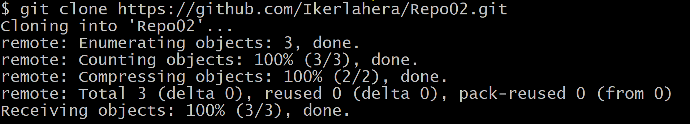
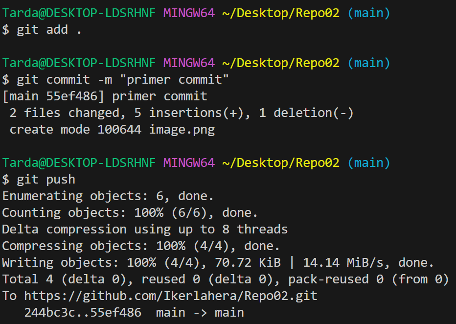

# Crear repositiorio remoto
  
Empiezo creado el repositorio directamente en github

Hago comando git clone para crear una copia del repositorio remoto en el equipo creando asi un repositorio local.

Ahora hago un add un commit y un push para subir los archivos del local al remoto.

PRUEBA
